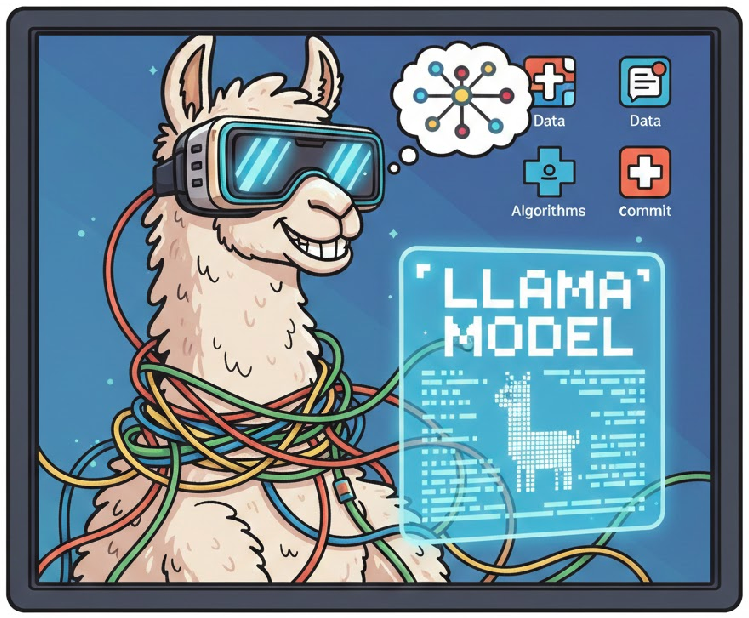

# Llama-2 Inference Implementation

<div align="center">
  
</div>


A clean, educational implementation of Llama-2 for inference, featuring a complete transformer architecture with key optimizations for efficient text generation.

## Overview

This repository provides a PyTorch implementation of the Llama-2 language model architecture, designed specifically for inference. The code is structured to be readable and educational while maintaining the core components of the Llama-2 architecture. The code was implemented with inspiration from Llama's official github and Umar Jamil's youtube videos. All credits and rights remain with the original creators.

## Features

- **Complete Transformer Architecture**: Full implementation of the Llama-2 decoder-only transformer
- **Rotary Position Embeddings (RoPE)**: Efficient positional encoding using complex numbers
- **RMSNorm**: Root Mean Square Layer Normalization for improved training stability
- **Grouped Query Attention (GQA)**: Efficient attention mechanism with shared key-value heads (7B model implements a version of it with repetition of the Key and Values heads.)
- **KV Cache**: Optimized inference with key-value caching for faster generation
- **SwiGLU Activation**: Swish-Gated Linear Unit activation function
- **Text Completion**: Support for temperature and top-p (nucleus) sampling

## Repository Structure

```
Llama-2/
├── model.py              # Core transformer model implementation
├── inference.py          # Inference script with LLaMa wrapper class
├── download.sh           # Script to download model weights from Meta (Script owned by meta, included in repo for completeness)
├── tokenizer.model       # SentencePiece tokenizer model (Not included: needs to be downloaded from download.sh)
├── llama-2-7b/          # Model checkpoint directory (Not included: needs to be downloaded from download.sh)
│   ├── consolidated.00.pth
│   ├── params.json
│   └── checklist.chk
├── LICENSE               # Llama 2 Community License Agreement
└── USE_POLICY.md         # Acceptable Use Policy (Llama use policy)
```

## Requirements

- Python 3.7+
- PyTorch (with CUDA support recommended)
- sentencepiece
- tqdm

Install dependencies:

```bash
pip install torch sentencepiece tqdm
```

## Getting Started

### 1. Download Model Weights

To use this repository, you need to download the Llama-2 model weights from Meta. You'll need to:

1. Request access to Llama-2 from [Meta's website](https://ai.meta.com/llama/)
2. Once approved, you'll receive a presigned URL via email
3. Run the download script:

```bash
bash download.sh
```

The script will prompt you for:
- The presigned URL from your email
- Which model size(s) to download (7B, 13B, 70B, or their chat variants)

### 2. Run Inference

The `inference.py` script provides a simple interface for text completion:

```python
from inference import LLaMa

# Generate text
prompts = [
    "Simply put, the meaning of life is ",
    "If one needs to study nuclear science, he should "
]

out_tokens, out_text = model.text_completion(
    prompts=prompts,
    temperature=0.6,
    top_p=0.9,
    max_gen_len=64
)

# Build the model
model = LLaMa.build(
    checkpoints_dir='llama-2-7b/',
    tokenizer_path='tokenizer.model',
    load_model=True,
    max_seq_len=1024,
    max_batch_size=len(prompts),
    device='cuda'  # or 'cpu'
)

for text in out_text:
    print(text)
```

### 3. Command Line Usage

You can also run the inference script directly:

```bash
python inference.py
```

This will run the example prompts defined in the script.
Note: There is a variable "allow_cuda" which can be set to True to use GPU acceleration. My local compute resources limited me to cpu.

## Model Architecture Details

### Key Components

1. **Transformer Block**: Each block consists of:
   - Pre-normalization with RMSNorm
   - Self-attention with grouped query attention
   - Feed-forward network with SwiGLU activation
   - Residual connections

2. **Attention Mechanism**:
   - Multi-head attention with configurable query/key-value head ratios
   - KV cache for efficient autoregressive generation
   - Rotary positional embeddings applied to queries and keys

3. **Feed-Forward Network**:
   - SwiGLU activation: `swish(w1(x)) * w3(x)`
   - Hidden dimension: `4 * dim` scaled by `2/3` and rounded to nearest multiple

### Model Configuration

The model parameters are defined in `params.json` within each model directory. For the 7B model:

```json
{
  "dim": 4096,
  "n_heads": 32,
  "n_layers": 32,
  "norm_eps": 1e-05,
  "vocab_size": -1
}
```

## API Reference

### `LLaMa.build()`

Builds and loads a Llama-2 model.

**Parameters:**
- `checkpoints_dir` (str): Path to directory containing model checkpoints
- `tokenizer_path` (str): Path to the tokenizer model file
- `load_model` (bool): Whether to load model weights from checkpoint
- `max_seq_len` (int): Maximum sequence length for KV cache
- `max_batch_size` (int): Maximum batch size for KV cache
- `device` (str): Device to run on ('cuda' or 'cpu')

**Returns:** `LLaMa` instance

### `LLaMa.text_completion()`

Generates text completions for given prompts.

**Parameters:**
- `prompts` (list[str]): List of input prompts
- `temperature` (float, optional): Sampling temperature (0.0 for greedy). Default: 0.6
- `top_p` (float, optional): Nucleus sampling parameter. Default: 0.9
- `max_gen_len` (int, optional): Maximum generation length. Default: None (uses max_seq_len - 1)

**Returns:** Tuple of `(out_tokens, out_text)` where:
- `out_tokens`: List of token sequences
- `out_text`: List of decoded text strings

## Implementation Notes

- **Inference Only**: This implementation is optimized for inference. For training, you would need to remove the KV cache and modify the forward pass to handle multiple tokens simultaneously.
- **Single Token Generation**: The model processes one token at a time during generation, which is standard for autoregressive language models.
- **Memory Management**: The code includes explicit memory cleanup after loading checkpoints to free up RAM.
- **Device Support**: Supports both CPU and CUDA, with automatic half-precision (FP16) on CUDA and BFloat16 on CPU.

## Limitations

- This is an inference-only implementation (no training support)
- Requires model weights from Meta (not included in repository)
- Model weights are large (7B model is ~13GB)
- Single token processing per forward pass (by design for autoregressive generation)

## License

This project is licensed under the **Llama 2 Community License Agreement**. See the [LICENSE](LICENSE) file for details.

**Important**: You must agree to the Llama 2 Community License Agreement and Acceptable Use Policy before using this software. See [USE_POLICY.md](USE_POLICY.md) for the Acceptable Use Policy.

## Acknowledgments

- Meta AI for releasing Llama-2 and providing the model weights
- Umar Jamil for indepth explanation.
- The open-source community for various optimizations and insights


